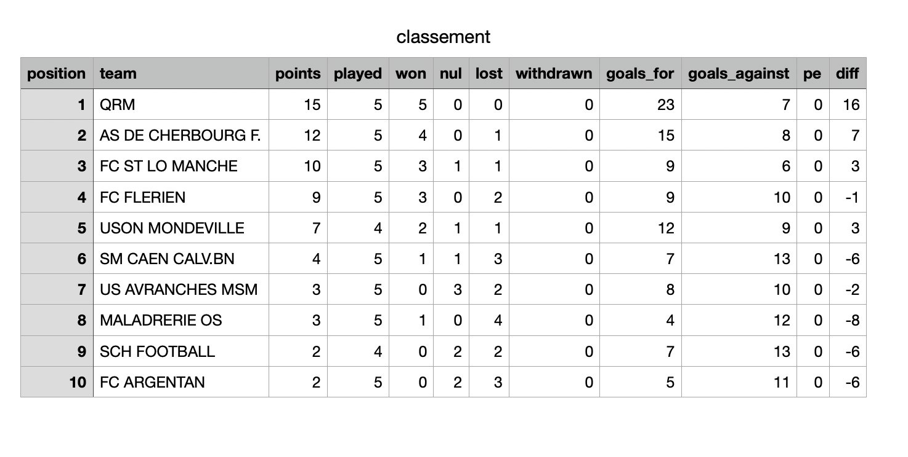
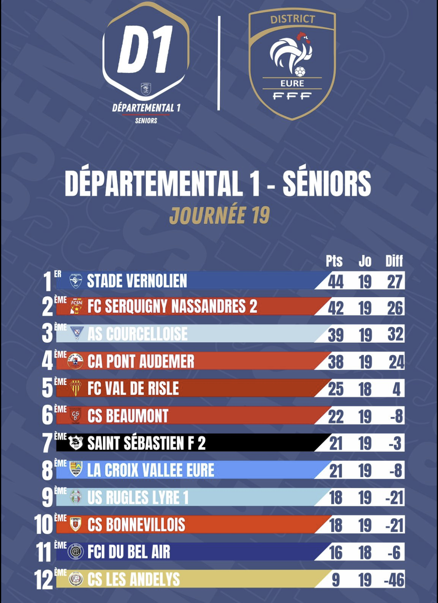

# Mini-Scraper

Ce script Python permet d’automatiser la récupération et la mise à jour du classement des championnats régionaux de football en Normandie.  
Il a été développé dans le cadre d’une collaboration avec un community manager (membre de ma famille), afin de gagner du temps dans la création des publications hebdomadaires sur les réseaux sociaux.
exemple d'output du script 

Voici un exemple de contenu réalisé à l’aide des données.

